# This branch is no long updated by Svea, the master branch has support for OC 2.3+

# Index <a name="index"></a>

* [I. Information](#i-information)
* [1. Installation](#i1)
    * [1.1 General](#i1-1)
    * [1.2 Checkout](#i1-2)
    * [1.3 Payment modules](#i1-3)
* [2. OpenCart configuration](#i2)
    * [2.1 Currency](#i2-1)
    * [2.2 Geo zones](#i2-2)
    * [2.3 Tax rates](#i2-3)
    * [2.4 Tax classes](#i2-4)
    * [2.5 Additional requirements](#i2-5)
* [3. Svea module configuration](#i3)
    * [3.1 Svea invoice fee](#i3-1)
    * [3.2 Checkout](#i3-2)
    * [3.3 Svea Invoice](#i3-3)
    * [3.4 Svea Payment plan](#i3-4)
    * [3.5 Svea Card payment](#i3-5)
    * [3.6 Svea Direct payment](#i3-6)
* [4. Miscellaneous](#i4)
    * [4.1 Administrating orders](#i4-1)
    * [4.2 Troubleshooting and recommendations](#i4-2)
    * [4.3 Product Price Widget](#i4-3)
    * [4.4 Important information](#i4-4)

# I. Information

## OpenCart 2.2 - Svea checkout and payment modules

* Supports OpenCart 2.2.0.0 (older and newer versions can be found in the branches)
* Requires PHP 5.3 or higher (namespace support)
* Features _Product Price Widget_ and admin functions requires [vQmod](https://github.com/vqmod) to be installed in your OpenCart installation
* Features Sveas new iframe checkout page
* Features Svea Checkout with invoices, payment plans, card and direct bank payments
* Features Payment modules for invoices, payment plans, card and direct bank payments in Sweden, Finland, Norway, Denmark, Netherlands and Germany.
* Features integrated admin functionality that corresponds with Sveas servers, current functions are delivering, confirming, canceling and crediting orders

This module is tested with a clean installation of [OpenCart 2.2](http://www.opencart.com/index.php?route=download/download) with [vQmod](https://github.com/vqmod) and it uses the latest Svea [php-integration](https://github.com/sveawebpay/php-integration) package.

If you are experiencing technical issues with this module, or if you have a feature suggestion, please submit an issue on the GitHub issue list.

For release history, see [**github release tags**](https://github.com/sveawebpay/opencart-module/releases)

# 1. Installation <a name="i1"></a>
Before installing, we recommend that you set up a test environment and make a backup of your existing site, database and settings.

The following examples assumes that you have already downloaded and installed OpenCart, if you are upgrading from a previous version of the module disable the module from the OpenCart admin before installing.

## 1.1 General <a name="i1-1"></a>
* Download the latest version of the module from repository
* Extract the contents of the folder "src/" into your OpenCart root directory, the folders _admin_, _catalog_, _svea_ should merge with the existing folders
* If you are going to use Svea Checkout see [1.2 Checkout](#i1-2) otherwise follow [1.3 Payment modules](#i1-3)

## 1.2 Checkout <a name="i1-2"></a>
* Login to the admin page
* Navigate to the Extensions/Payments page and find Svea Checkout
* Install Svea Checkout
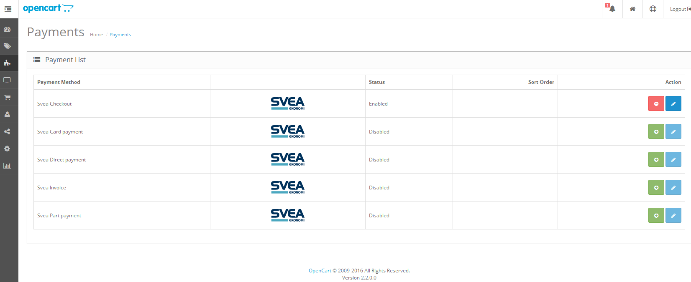
* Navigate to the Extensions/Modules page and find Svea Checkout
* Install Svea Checkout
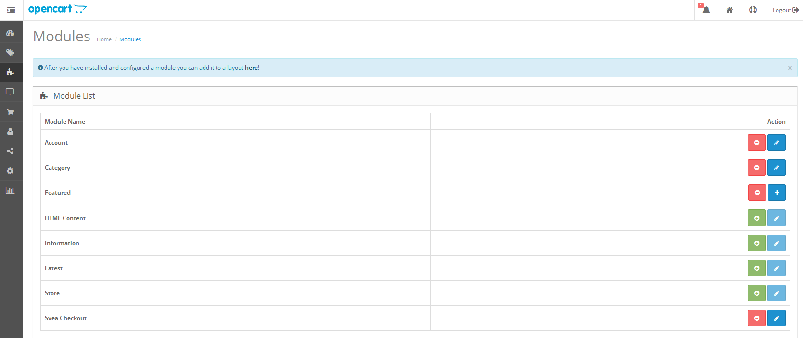
* Proceed to [2. OpenCart configuration](#i2)

## 1.3 Payment modules <a name="i1-3"></a>
* Login to the admin page
* Navigate to the Extensions/Payments page
* Install all the modules that you are going to use
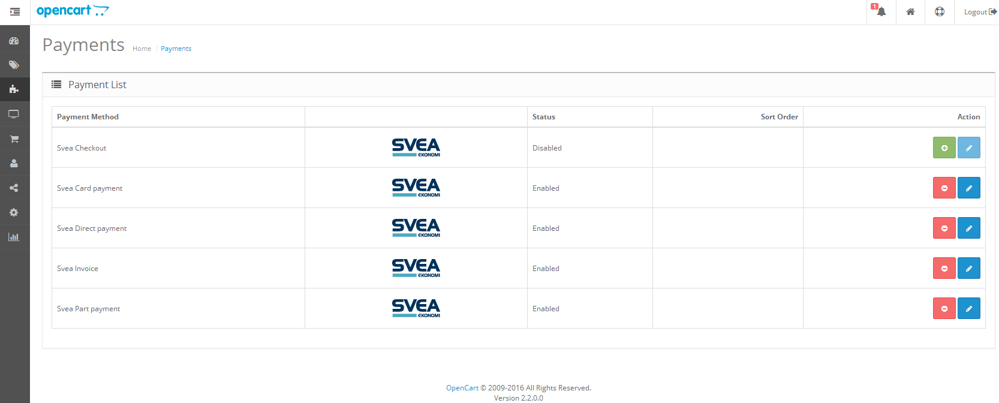
* Proceed to [2. OpenCart configuration](#i2)

# 2. OpenCart configuration <a name="i2"></a>

These steps contain general setup information regarding OpenCart, if you already have settings for currencies, geo zones, tax classes and tax rates you can proceed to section [2.5 Additional requirements](#i2-5).

## 2.1 Currency <a name="i2-1"></a>
* Navigate to System/Localisation/Currencies
* Click the plus sign in the top-right corner to add a new currency
* Fill in the [**ISO-code**](https://en.wikipedia.org/wiki/ISO_4217) e.g. "SEK" for Swedish Krona
* Fill out the rest of fields and click save in the top-right corner
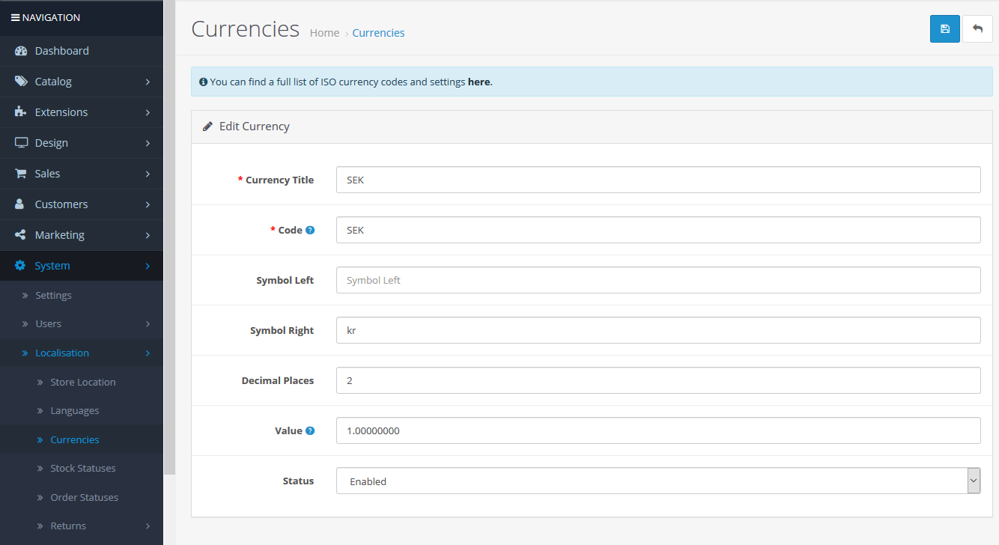
* Add as many currencies as you want
* Press refresh currency values in the top-right corner

## 2.2 Geo zones <a name="i2-2"></a>
* Navigate to System/Localisation/Geo Zones
* Click the plus sign in the top-right corner to add a new geo zone
* Fill out the fields and add a country
* By not selecting any zone in the table(like in the example below) you will select all zones within the chosen country
* Save
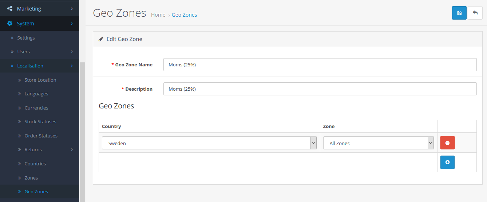

## 2.3 Tax rates <a name="i2-3"></a>
* Navigate to System/Localisation/Taxes/Tax Rates
* Click the plus sign in the top-right corner to add a new tax rate
* Fill out the fields and select the geo zone you created in the previous step and save
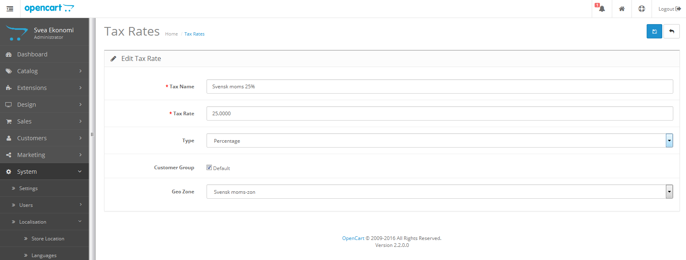

## 2.4 Tax classes <a name="i2-4"></a>
* Navigate to System/Localisation/Taxes/Tax Classes
* Click the plus sign in the top-right corner to add a new tax rate
* Fill out the fields and add the tax rate you created in the previous step and save
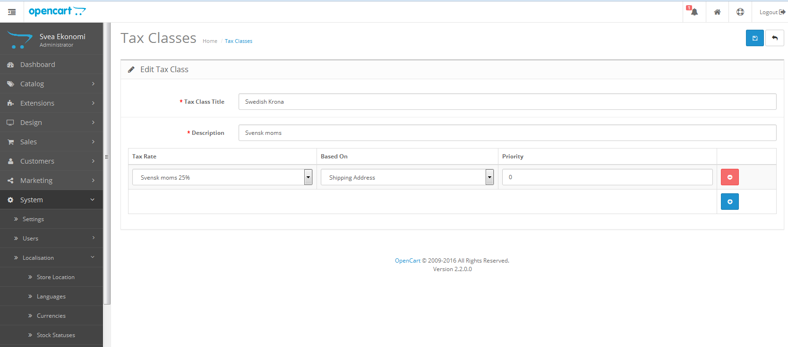

## 2.5 Additional requirements <a name="i2-5"></a>
### Specifying prices
* The product prices must be given in the default currency if multiple currencies are used.
* Also, prices must be given excluding any taxes.
* Currency decimals must be set to two (2) when using Euro currency.

### Customer registration required fields
* For use in Dutch and German stores the postal code needs to be set to required for customer registrations.

### Order Total module sort order
* For use with vouchers, the voucher module sort order must be after taxes.
* For coupons, the coupon module sort order (in admin, under extensions/order totals) must be set to have a lower sort order than taxes.
* Also, the coupon discount amount (in admin, under sales/coupon) must be specified excluding tax. The coupon tax discount will then be calculated in accordance with OpenCart standard behaviour, and is specified in the order history.
* The recommended order total sort order is: sub-total (lowest), Svea invoice fee, shipping, coupon, taxes, store credit, voucher and total.

### A note on specifying taxes in OpenCart
If you have your shop set up to sell mainly to Swedish customers, but have a substantial number of sales to a foreign country (here: Norway), you might want to charge Swedish tax for Swedish customers, and Norwegian tax for Norwegian customers. Ask your accountant for the precise sales numbers required, or sales abroad in general.

This is done by specifying a tax class containing two different tax rates, one for Sweden and one for Norway with the appropriate tax rates. The tax rates each contain a geo zone. For the Swedish tax rate, the geo zone should include all countries where Swedish vat should be charged (i.e. typically all countries that you sell to, but excluding Norway). The Norwegian tax rate geo zone should then include the countries where Norwegian vat should be charged (i.e. Norway only).

In the tax class settings, make sure that the Norwegian tax rate applies before the Swedish tax rate, i.e. has a higher priority than the Swedish tax rate, and that all tax rate selections are based on the customer Payment Address. The same procedure applies be used for products and i.e. the Svea invoice fee.

# 3. Svea module configuration <a name="i3"></a>
After configuring the invoice fee in [3.1](#i3-1) go to either [3.2](#i3-2) Checkout or [3.3](#i3-3) Svea Invoice depending on which one you installed above.

## 3.1 Svea Invoice Fee <a name="i3-1"></a>
* Navigate to Extensions/Order Totals in your OpenCart admin
* Find _Svea Invoice Fee_ in the list and install it
* For each country which you will accept invoice payments from, select the corresponding tab and fill all the fields
* Set the _status_ field to _enabled_
* Set the _fee_ for each country that you are going to accept invoices from(the amount is excluding VAT)
* Select the _tax class_ you created earlier in section [2.4](#i2-4)
* Select a value for the _sort order_ e.g. 4 or 5, preferably a value lower than the sort order for taxes otherwise there will be no tax on the invoice fee
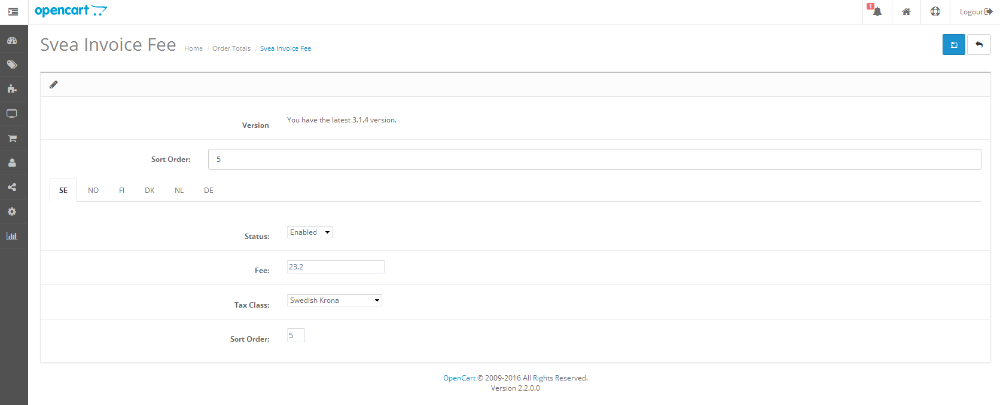

## 3.2 Checkout  <a name="i3-2"></a>
* Navigate to Extensions/Modules and press edit on Svea Checkout
* First select the Authorization tab and fill out your credentials that you received from Svea after signing an agreement with us
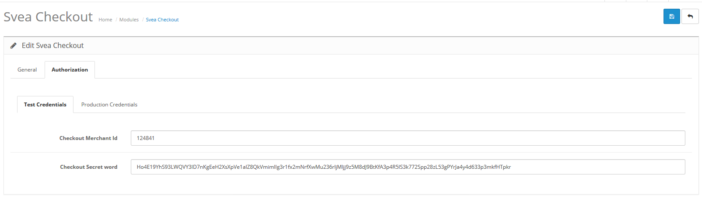
* Go back to the General tab
* Set _Status_ to _Enabled_
* Set _Test mode_ to _Enabled_ as you will be needing to do tests before we will allow you to use our production environment
* Set _Show default checkout option_ to _Enabled_
* Set _Pending_ to _Pending_
* Set _Failed_ to _Failed_
* Set _Canceled/Annulled_ to _Canceled_
* Set _Credited_ to _Credited_

Congratulations! You have now configured all the required settings for the checkout and can now proceed with testing! You don't have to read anything else from section 3 as it's only if you're not using the checkout.
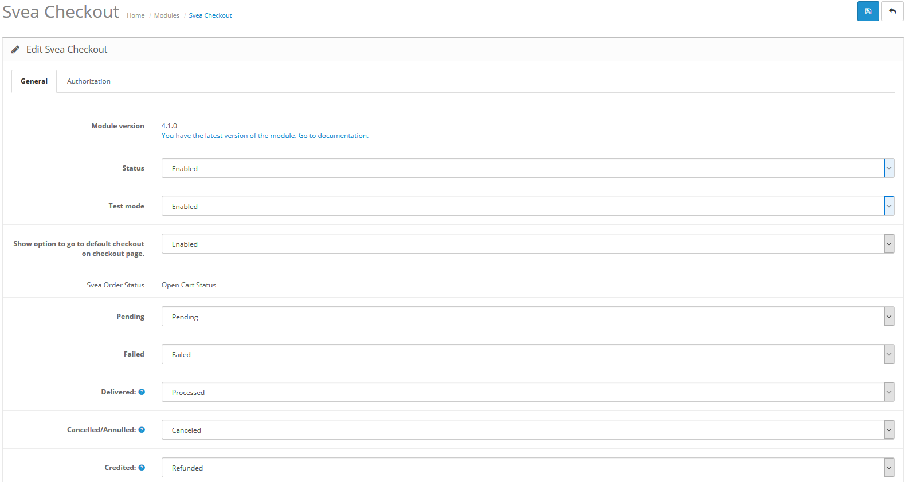

## 3.3 Svea Invoice <a name="i3-3"></a>
* Navigate to Extensions/Payments
* Find Svea Invoice in the list and press Edit
* Set the _geo zone_ and _sort order_ to your preferences
* Set _Status_ to Enabled
* Add a description if you want that for the payment method that's shown to the customer
* Set the order statuses with the order statuses you want to trigger the corresponding action to Svea admin. When you edit an order and change the order status, an request will be sent to Svea. The actions available for invoices are Deliver, Credit and Cancel order
* Set _Shipping same as billing_ to _yes_ unless your contract with Svea says otherwise
* Set _Auto deliver order_ to _Disabled_
* Set Invoice distribution type to either _Post_ if you want the invoices to go by post or _Email_ if you wish for the invoices to get delivered by _Email_
* Fill out the information for each country that you have a client number for
* Set _test mode_ to _Enabled_ since you will need to do test purchases before you can use the production environment
* Svea Invoice should now be properly configured


## 3.4 Svea Payment plan  <a name="i3-4"></a>
* Navigate to Extensions/Payments
* Find Svea payment plan and press Edit
* Set the order statuses with the order statuses you want to trigger the corresponding action to Svea admin. When you edit an order and change the order status, an request will be sent to Svea. The actions available for Payment Plan are Deliver, Credit and Cancel order
* Set the _min. amount_ to the lowest value that's needed for a campaign to be shown(usually 500)
* Set _test mode_ to _Enabled_ since you will need to do test purchases before you can use the production environment
* Svea Part payment should now be properly configured

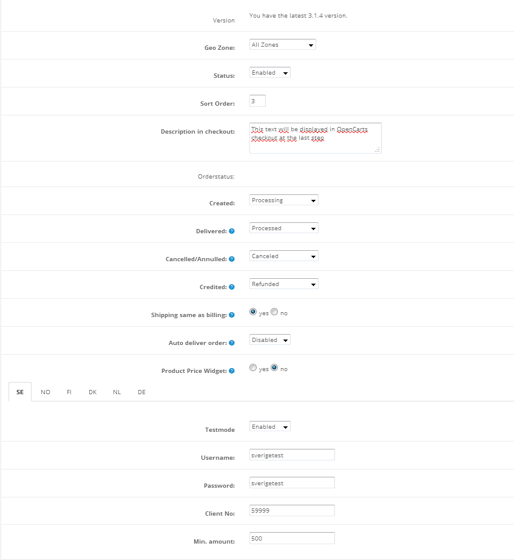

## 3.5 Svea Card payment <a name="i3-5"></a>
Our module supports one Svea merchant id per Opencart installation
* Navigate to Extensions/Payments
* Locate Svea card payment in the list, and then press Edit
* Set _geo zone_ and _sort order_ according to your preferences
* Set the order statuses with the order statuses you want to trigger the corresponding action to Svea admin. When you edit an order and change the order status, an request will be sent to Svea. The actions available for Card are Deliver, Credit and Cancel order
* Set _test mode_ and _status_ to enabled since you will need to do test purchases before you can use the production environment
* Fill out the required fields _merchant id_ and _secret word_. There are tabs for each _test_ and _prod_. For _prod_, use your Svea account credentials. For _test_, make sure to use the supplied test account credentials

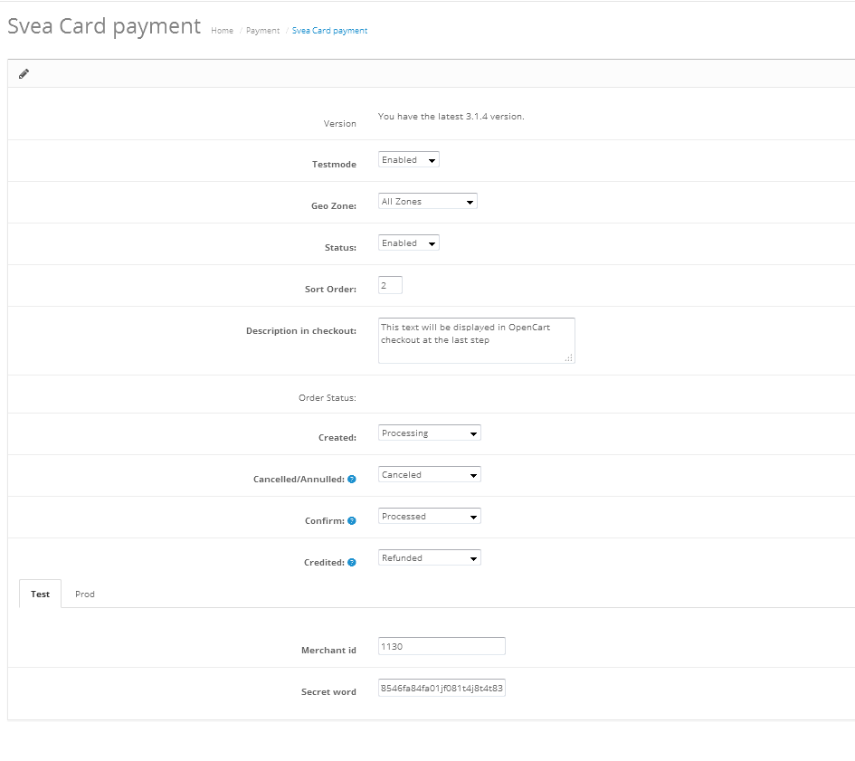

## 3.6 Svea Direct payment <a name="i3-6"></a>
Our module supports one Svea merchant id per Opencart installation.
* Navigate to Extensions/Payments
* Locate Svea Direct payment, and then press Edit
* Set _geo zone_ and _sort order_ according to your preferences
* Set the order statuses with the order statuses you want to trigger the corresponding action to Svea admin. When you edit an order and change the order status, an request will be sent to Svea. The actions available for Direct Bank is Credit order
* Set _testmode_ and _status_ to enabled since you will need to do test purchases before you can use the production environment (only applies to Nordea, because there is no test environment for the other banks)
* Fill out the required fields _merchant id_ and _secret word_. There are tabs for each _test_ and _prod_. For _prod_, use your Svea account credentials. For _test_, make sure to use the supplied test account credentials.

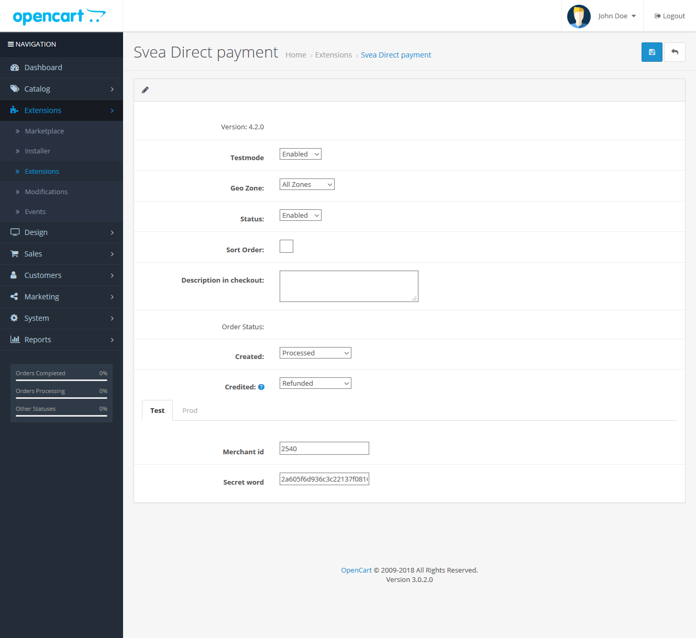

# 4. Miscellaneous <a name="i4"></a>

## 4.1 Administrating orders <a name="i4-1"></a>
**Important!** The Svea order id information saved in the Comment field must not be changed for the action to work. You may add to the information, but not change or remove it.

* Go to Sales -> Orders -> Edit order -> Totals tab
* When you change the _Order Status_ to the same status set in module, the action will be sent to Svea admin aswell, meaning you do not have to log in to the Svea admin.
* Save.

Actions available:

| Method        | Deliver order | Cancel order  |   Credit order    | Auto Deliver order  |
|---------------|:-------------:|:-------------:|:-----------------:|:-------------------:|
| Invoice       |   *           |   *           |   *               |   *                 |
| Payment plan  |   *           |   *           |                   |   *                 |
| Card          |   *           |   *           |   *               |                     |
| Direct bank   |               |               |   *               |                     |

## 4.2 Troubleshooting and recommendations <a name="i4-2"></a>
Always check that your settings are properly configured before posting issues or contacting our support, go through these steps first:

### Check your Svea customer credentials

* Your _username, password, client no_ for Invoice and Part Payment are correct.
* Your _secret word_ and _merchant id_ for Card and Direct bank payments are correct and that the test-secret word and production-secret word are in their right places.

### Check correlated OpenCart settings and localisations

* Under _system -> localisation_, the correlating _tax class, tax rate_ (including customer groups), _currency_ and _geo zone_ settings are correct.
* Under _extensions -> order totals_, the sort order et al are correct.
* You are using correct test case credentials when conducting test purchases.

### Specific payment method problems FAQ

#### The invoice fee shows doesn't seem to be included in the OpenCart order total, though it is present in the Svea invoice?
Ensure that you have specified a valid tax class for the country in question in the Svea invoice fee module.

#### My card or direct payments don't go through after reinstalling my shop?
Check that you don't attempt to reuse order numbers, they need to be unique. I.e. in the call to

```$form = WebPay::createOrder()-> ... ->setClientOrderNumber("33")-> ... ```

the order number "33" can't have been used in a previous order.

#### My payment plan method is not displaying any campaigns, what can I do?
First make sure that you have a cart filled with items of a value that fits in one of the campaigns, if that doesn't solve it follow these steps:
*Navigate to Extensions/Payments
*Find Svea payment plan and press Edit
*Scroll down to the bottom find the _Min. amount_ box
Is the amount too high? In that case, lower it and press Save

Pressing save will send a request to our servers which will update all your campaigns.

## 4.3 Product Price Widget <a name="i4-3"></a>

If you set "Show Product Price Widget" to yes in your module options a widget will be displaying the minimum invoice amount to pay on the product page. Note: Only applicable if Svea buys the invoices, and for private customers.
Only applies in Sweden, Norway, Finland and the Netherlands.
Note! Requires [vQmod](https://github.com/vqmod)

## 4.4 Important information <a name="i4-4"></a>

The request made from the card and direct payment modules to Sveas systems is made through a redirected form.
The response of the payment is then returned to the module via POST or GET (selectable in the corresponding Svea admin interface).

#### When using GET response
Have in mind that a long response string sent via GET could get cut off in some browsers and especially in some servers due to server limitations.
Our recommendation to solve this is to check the PHP configuration of the server and set it to accept at LEAST 1024 characters.

#### When using POST response
As our servers are using SSL-certificates and when using POST to get the response from a payment the users browser prompts the user with a question whether to continue or not, if the receiving site does not have a certificate.
Would the customer then click cancel, the process does not continue.  This does not occur if your server holds a certificate. To solve this we recommend that you purchase a SSL-certificate from your provider.
